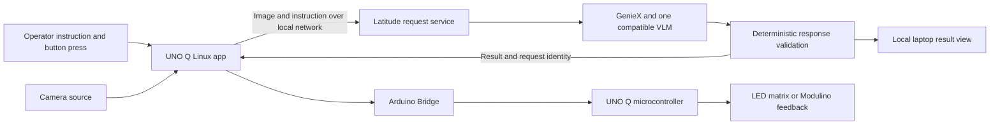

# Proposed architecture

Nothing in this document is implemented yet. It describes the first prototype and the boundary between that prototype and later routing work.

## First prototype

The preferred capture path is a USB webcam connected to UNO Q through a suitable powered hub. Arduino also documents [phone-to-UNO-Q camera streaming over local Wi-Fi](https://blog.arduino.cc/2026/03/06/turn-your-smartphone-into-a-real-time-vision-input-for-arduino-uno-q/). Neither path has been tested by this team. If capture has to run on the laptop initially, the board can still handle operator controls and results, but that version does not demonstrate independent edge camera capture.

## Device responsibilities

| Component | First milestone | Possible extension |
|---|---|---|
| UNO Q Linux processor | Capture an image, attach request metadata, send it to the laptop and receive the result | Change/stability filtering or a small validated detector |
| UNO Q microcontroller | Read controls and drive feedback through Bridge | More deterministic peripheral behavior |
| Latitude | Host a request service, run one VLM through GenieX, validate its answer and display the result | Policy evaluation and event history |
| Knob / Buttons | Choose a saved instruction and request or retry an inspection | Operator acknowledgement or labelled evaluation input |
| LED matrix / Pixels / Vibro / Buzzer | Indicate progress and result | Distinct tactile and audible patterns |

[Arduino Bridge](https://docs.arduino.cc/hardware/uno-q) provides communication between Linux applications and microcontroller sketches. Module library compatibility must be checked against the installed board software. Vibro is an output motor; none of the listed modules provides scene imagery or vibration measurements.

## Model and runtime

[Qwen3-VL-4B-Instruct](https://aihub.qualcomm.com/models/qwen3_vl_4b_instruct) is a candidate: Qualcomm documents a GenieX deployment and X Elite support. Its presence on our Latitude has not been checked, and the team has not tested it. Select from models compatible with the actual device and runtime, then test a real image before committing to it.

The intended target is the Latitude's Hexagon NPU. A model name, `--compute npu` request or vendor TOPS figure is not proof of active NPU execution. Record runtime/backend logs and corroborating device evidence. A fallback backend must be labelled accurately. Do not assume UNO Q has the same NPU or model support as X Elite.

GenieX offers an [OpenAI-compatible local serving interface](https://geniex.aihub.qualcomm.com/en/run/cli/reference), which we plan to put behind a small application service. Endpoint details, model response support and image input behavior must be confirmed with the installed version. No application server port or API contract is finalized.

For QAIRT bundles, the context limit is fixed when the bundle is compiled; increasing `--nctx` does not enlarge it. Keep inspection requests short and independent, and check the selected bundle's limit before adding conversational history. See the [runtime constraints in the CLI reference](https://geniex.aihub.qualcomm.com/en/run/cli/reference#increasing-the-context-length).

## Result handling

The application owns the result state. The model proposes a constrained answer; deterministic code checks it before any physical indication.

| State | Meaning | Planned indication |
|---|---|---|
| IDLE | No current inspection | Neutral display |
| INSPECTING | A fresh request is in progress | Progress pattern |
| OK | The current image satisfies the current instruction | Green Pixels or an OK matrix pattern |
| CHECK | The current image visibly violates the instruction | Red Pixels or a CHECK pattern |
| UNKNOWN | The result cannot be established or the request failed | Amber Pixels or a distinct UNKNOWN pattern |

Each request should carry a unique ID, a frame timestamp, an instruction version and a deadline. Responses should identify their request and contain a bounded status and short explanation. These are proposed fields, not an existing API.

Reject malformed answers and mismatched or expired responses. Clear the previous OK when a new inspection starts, the instruction changes, the camera disconnects or the result expires. Use a local timer on the board so a broken laptop connection cannot leave an OK displayed indefinitely. Expiry values must be selected during testing.

Keep responses out of executable code paths. The MCU should receive only an allowlisted indication command. This prototype controls feedback devices; it is not a machine interlock.

## From trigger to inference policy

The first version always sends a requested inspection to the laptop. A later event gate could skip unchanged frames, but skipped time windows must still count in evaluation. Periodic sampling does not guarantee that short events will be observed.

A routing extension would need actual alternatives: a board model that can answer a validated subset of questions, a laptop model for contextual judgments, and explicit conditions for requesting human review. Policy inputs could include supported task type, freshness, queue depth, measured runtime and the local-only privacy constraint.

A cheap detector must not declare a scene OK for a language instruction it cannot evaluate. Cache entries must be bound to instruction version and scene validity. With only one working inference destination, describe the system as an event-triggered pipeline or cascade.

## Data and measurements

The intended visual core sends images only between the board and laptop. Model downloads and development tools can require internet access during setup. Optional hosted voice would send audio to its provider; it is a separate mode.

Initially keep only the metadata needed to debug requests and measure results. Raw image retention should be explicit. Record end-to-end elapsed time, VLM calls, transferred bytes, backend evidence, correctness and missed events. Tokens per second and call counts are not NPU utilization or energy measurements. No savings or performance numbers have been measured yet.
